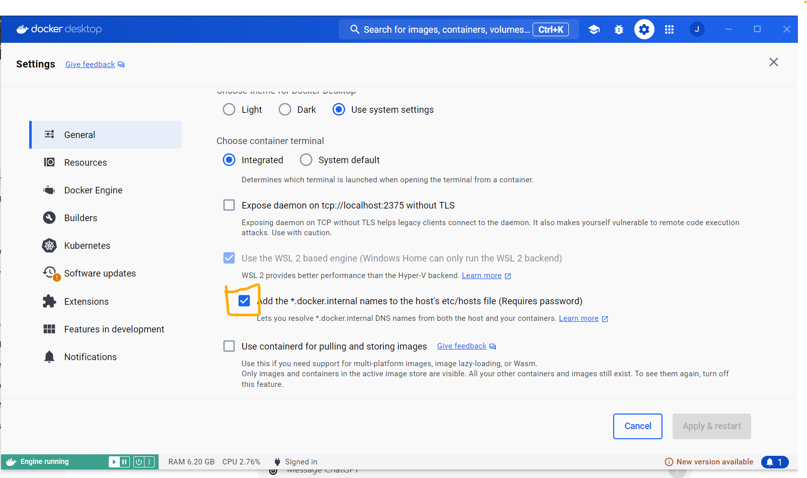

# sotl
## Project Structure

### Client

- **client/sotl**
  - **public**: Static files
  - **src**
    - **api**: API calls
    - **assets**: Static assets (images, etc.)
    - **components**: Reusable UI components
    - **context**: React context providers
    - **hooks**: Custom React hooks
    - **pages**: Page components

### Server

- **server/src**
  - **controllers**: Business logic for handling requests
  - **database**: Database connection and schema definitions
  - **middlewares**: Express middleware
  - **models**: Mongoose models
  - **routes**: API routes
  - **index.ts**: Entry point of the server

## NPM Packages

### Client

- `@mui/material`: MUI library for UI components
- `@emotion/react`: Emotion library for CSS-in-JS styling
- `@emotion/styled`: Styled components for Emotion
- `axios`: HTTP client for making requests
- `socket.io-client`: Client-side library for WebSocket communication
- `typescript`: TypeScript support
- `vite`: Build tool for React

### Server

- `express`: Web framework for Node.js
- `mongoose`: ODM for MongoDB
- `socket.io`: Library for WebSocket communication
- `cors`: Middleware for handling CORS
- `dotenv`: Environment variable management
- `typescript`: TypeScript support
- `ts-node`: TypeScript execution for Node.js
- `nodemon`: Tool for automatically restarting the server

## Installation

### Locally

1. **Clone the Repository**

 ```bash
 git clone <repository-url>
 cd <repository-folder>
 ```

2. **Install Client Dependencies**

Navigate to the client directory and install the dependencies:

   ```bash
   cd client/sotl
   npm install
   ```

Navigate to the server directory and install the dependencies:

   ```bash
    cd ../server
    npm install
   ```
 
3. **Set Up Environment Variables**

Create a .env file in the server directory with content from .env.sample

Open two terminal windows. In the first terminal, run the client:

  ```bash
  cd client/sotl
    npm run dev
  ```
In the second terminal, run the server:

  ```bash
  cd server
  npm start
  ```
### Using Docker Compose
Build and Run Containers

Make sure you have Docker and Docker Compose installed. Then, run:

```bash
docker-compose up --build
```

Access the Application

The client will be available at http://localhost:3000 and the server at http://localhost:5000.

### Check Replica Set is worked on Docker Compose
[Reference 1](https://medium.com/workleap/the-only-local-mongodb-replica-set-with-docker-compose-guide-youll-ever-need-2f0b74dd8384)
[Reference 2](https://medium.com/@JosephOjo/mongodb-replica-set-with-docker-compose-5ab95c02af0d)

Go Docker desktop's setting and tick the orange color checkbox.

After running the docker compose, open a new terminal and the command below. It access the primary_database container.
```
docker exec -it sotl-mongo_primary-1 bash
```
Once access the primary_database container, run command below to launch the mongodb client terminal.
```
mongosh
```
Once the mongodb client is launch, run command below, it will display the replica set's info if replica set is set-up properly
```
rs.status()
```
Sample Result
```
{
  set: 'rs0',
  date: ISODate('2024-08-27T10:32:47.223Z'),
  myState: 1,
  term: Long('1'),
  syncSourceHost: '',
  syncSourceId: -1,
  heartbeatIntervalMillis: Long('2000'),
  majorityVoteCount: 2,
  writeMajorityCount: 2,
  votingMembersCount: 2,
  writableVotingMembersCount: 2,
  optimes: {
    lastCommittedOpTime: { ts: Timestamp({ t: 1724754758, i: 1 }), t: Long('1') },
    lastCommittedWallTime: ISODate('2024-08-27T10:32:38.796Z'),
    readConcernMajorityOpTime: { ts: Timestamp({ t: 1724754758, i: 1 }), t: Long('1') },
    appliedOpTime: { ts: Timestamp({ t: 1724754758, i: 1 }), t: Long('1') },
    durableOpTime: { ts: Timestamp({ t: 1724754758, i: 1 }), t: Long('1') },
    lastAppliedWallTime: ISODate('2024-08-27T10:32:38.796Z'),
    lastDurableWallTime: ISODate('2024-08-27T10:32:38.796Z')
  },
  lastStableRecoveryTimestamp: Timestamp({ t: 1724754698, i: 1 }),
  electionCandidateMetrics: {
    lastElectionReason: 'electionTimeout',
    lastElectionDate: ISODate('2024-08-27T10:23:55.402Z'),
    electionTerm: Long('1'),
    lastCommittedOpTimeAtElection: { ts: Timestamp({ t: 1724754225, i: 1 }), t: Long('-1') },
    lastSeenOpTimeAtElection: { ts: Timestamp({ t: 1724754225, i: 1 }), t: Long('-1') },
    numVotesNeeded: 2,
    priorityAtElection: 1,
    electionTimeoutMillis: Long('10000'),
    numCatchUpOps: Long('0'),
    newTermStartDate: ISODate('2024-08-27T10:23:58.691Z'),
    wMajorityWriteAvailabilityDate: ISODate('2024-08-27T10:23:59.154Z')
  },
  members: [
    {
      _id: 0,
      name: 'host.docker.internal:27017',
      health: 1,
      state: 1,
      stateStr: 'PRIMARY',
      uptime: 548,
      optime: { ts: Timestamp({ t: 1724754758, i: 1 }), t: Long('1') },
      optimeDate: ISODate('2024-08-27T10:32:38.000Z'),
      lastAppliedWallTime: ISODate('2024-08-27T10:32:38.796Z'),
      lastDurableWallTime: ISODate('2024-08-27T10:32:38.796Z'),
      syncSourceHost: '',
      syncSourceId: -1,
      infoMessage: '',
      electionTime: Timestamp({ t: 1724754236, i: 1 }),
      electionDate: ISODate('2024-08-27T10:23:56.000Z'),
      configVersion: 1,
      configTerm: 1,
      self: true,
      lastHeartbeatMessage: ''
    },
    {
      _id: 1,
      name: 'host.docker.internal:27019',
      health: 1,
      state: 2,
      stateStr: 'SECONDARY',
      uptime: 542,
      optime: { ts: Timestamp({ t: 1724754758, i: 1 }), t: Long('1') },
      optimeDurable: { ts: Timestamp({ t: 1724754758, i: 1 }), t: Long('1') },
      optimeDate: ISODate('2024-08-27T10:32:38.000Z'),
      optimeDurableDate: ISODate('2024-08-27T10:32:38.000Z'),
      lastAppliedWallTime: ISODate('2024-08-27T10:32:38.796Z'),
      lastDurableWallTime: ISODate('2024-08-27T10:32:38.796Z'),
      lastHeartbeat: ISODate('2024-08-27T10:32:46.000Z'),
      lastHeartbeatRecv: ISODate('2024-08-27T10:32:46.644Z'),
      pingMs: Long('2'),
      lastHeartbeatMessage: '',
      syncSourceHost: 'host.docker.internal:27017',
      syncSourceId: 0,
      infoMessage: '',
      configVersion: 1,
      configTerm: 1
    }
  ],
  ok: 1,
  '$clusterTime': {
    clusterTime: Timestamp({ t: 1724754758, i: 1 }),
    signature: {
      hash: Binary.createFromBase64('AAAAAAAAAAAAAAAAAAAAAAAAAAA=', 0),
      keyId: Long('0')
    }
  },
  operationTime: Timestamp({ t: 1724754758, i: 1 })
}
```

# VPS Hosting
## Copy file to VPS
```
scp path/to/your-file.zip username@vps_ip:/path/to/destination/
```

## Run Replica Set (if Replica Set is not work)
Step 1: Access primary mongodb container's mongosh
```
docker exec -it <primary_mongodb_container_id> mongosh
```
Step 2: Initiate Replica Set
```
rs.initiate({
  _id: "rs0",
  members: [
    { _id: 0, host: "mongo_primary:27017" },
    { _id: 1, host: "mongo_secondary:27019" }
  ]
});

```
Step 3: Check the Replica Set status (Verify it's initialize or not)
```
rs.status();

```

## nginx.conf code written on vps server
```
events {}

http {
    server {
        listen 80;
        server_name seproject.net;

        location /api/ {
            proxy_pass http://<container_name>:5000; # Forward to the frontend service
            proxy_http_version 1.1;
            proxy_set_header Upgrade $http_upgrade;
            proxy_set_header Connection 'upgrade';
            proxy_set_header Host $host;
            proxy_cache_bypass $http_upgrade;
        }

        location / {
            proxy_pass http://<container_name>:3000; # Forward to the frontend service
            proxy_http_version 1.1;
            proxy_set_header Upgrade $http_upgrade;
            proxy_set_header Connection 'upgrade';
            proxy_set_header Host $host;
            proxy_cache_bypass $http_upgrade;
        }
    }
}
```

## Make MongoDB public to external IP address to access (Can Skipped if have already open to public)
By default the mongodb (from docker) can only be access by the hosted local machine. If want to make enable remote access through MongoDB Compass. You need to manually edit the /etc/mongod.conf.orig file on each mongodb container

### Step 1: Copy a /etc/mongod.conf.orig file to ubuntu os
As the mongodb container bash, unable to do any file edit (if have, just use that method)
```
docker cp <mongodb_container_id>:/etc/mongod.conf.orig ./mongod.conf.orig 
```

### Step 2: Edit on mongod.conf.orig file
Edit file
```
nano mongod.conf.orig
```
add vps_ip_address to
```
# network interfaces
net:
  port: 27017
  bindIp: 127.0.0.1,<vps_ip_address>
```

### Step 3: Copy the mongod.conf.orig file to mongodb container 
```
docker cp ./mongod.conf.orig <mongodb_container_id>:/etc/mongod.conf.orig
```

### Step 4: Setup Ubuntu ufw firewall (can Skipped if have installed)
Setup ufw, first of all, enable ufw (if it's not active). Then setup your mongodb's port listen to restricted IP
```
sudo ufw allow from <your_laptop_ip_address> to any port 27017
```
If want to make your mongodb's port enable to access by any IP address
```
sudo ufw allow 27017
```
Check ufw status
```
sudo ufw status
```

# SSL Certificate
Install Certbot on your VPS (assuming you're using Ubuntu)
```
sudo apt update
sudo apt install certbot python3-certbot-nginx

```
Obtain the SSL certificate for your domain (replace seproject.net with your actual domain):
```
sudo certbot --nginx -d seproject.net

```
Setup Production Nginx
```
events {}

http {
    server {
        listen 443 ssl;
        server_name seproject.net;

        ssl_certificate /etc/letsencrypt/live/seproject.net/fullchain.pem;
        ssl_certificate_key /etc/letsencrypt/live/seproject.net/privkey.pem;

        location /api/ {
            proxy_pass http://sotl_backend_1:5000; # Forward to the frontend service
            proxy_http_version 1.1;
            proxy_set_header Upgrade $http_upgrade;
            proxy_set_header Connection 'upgrade';
            proxy_set_header Host $host;
            proxy_cache_bypass $http_upgrade;
        }

        location / {
            proxy_pass http://sotl_frontend_1:3000; # Forward to the frontend service
            proxy_http_version 1.1;
            proxy_set_header Upgrade $http_upgrade;
            proxy_set_header Connection 'upgrade';
            proxy_set_header Host $host;
            proxy_cache_bypass $http_upgrade;
        }
    }

    server{
        listen 80;
        server_name seproject.net;
        return 301 https://$host$request_uri;
    }
}

```
Reload Nginx
```
sudo nginx -s reload
```
Setup Auto-Renewal for Let's Encrypt
```
sudo certbot renew --dry-run
```

mount certificate path to nginx volume
```
services:
  nginx:
    image: nginx:1.26.2
    ports:
      - "80:80"   # HTTP
      - "443:443" # HTTPS
    volumes:
      - ./nginx.conf:/etc/nginx/nginx.conf:ro  # Mount custom Nginx configuration
      - /etc/letsencrypt:/etc/letsencrypt:ro   # Mount SSL certificates from host to container
    depends_on:
      - frontend
      - backend
    networks:
```

## Licenses

This project uses the following open-source libraries:

- SheetJS Community Edition (https://github.com/SheetJS/sheetjs), licensed under the Apache 2.0 License. See LICENSE for details.

- react-data-table-component, licensed under MIT License